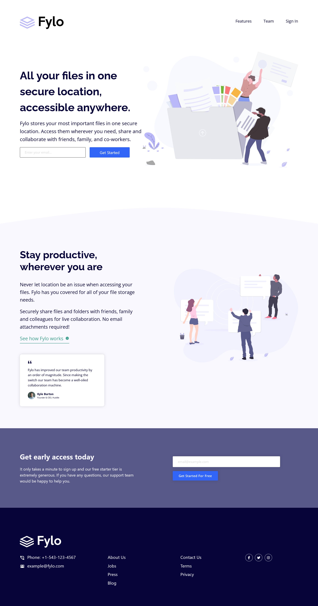

## Table of contents

-   [Overview](#overview)
-   [The challenge](#the-challenge)
-   [Screenshot](#screenshot)
-   [Links](#links)
-   [Built with](#built-with)
-   [Author](#author)

## Overview

This challenge is designed based on the provided template from Frontend Mentor which help us improve our coding skills by building realistic projects.

### The challenge

Users should be able to:

-   View the optimal layout for the site depending on their device's screen size
-   See hover states for all interactive elements on the page

### Screenshot

### Links

-   Solution URL: [https://github.com/Albrt78/frontend_mentor_project/tree/main/Fylo%20Landing%20Page]
-   Live Site URL: [https://65b5f18bcdadaf21d7c69765--luminous-bunny-12b656.netlify.app/]

### Built with

-   Semantic HTML5 markup
-   CSS custom properties
-   Mobile-first workflow
-   JavaScript
-   [Bootstrap5](https://getbootstrap.com) - CSS framework

## Author

-   Frontend Mentor - [@Albrt78](https://www.frontendmentor.io/profile/Albrt78)
